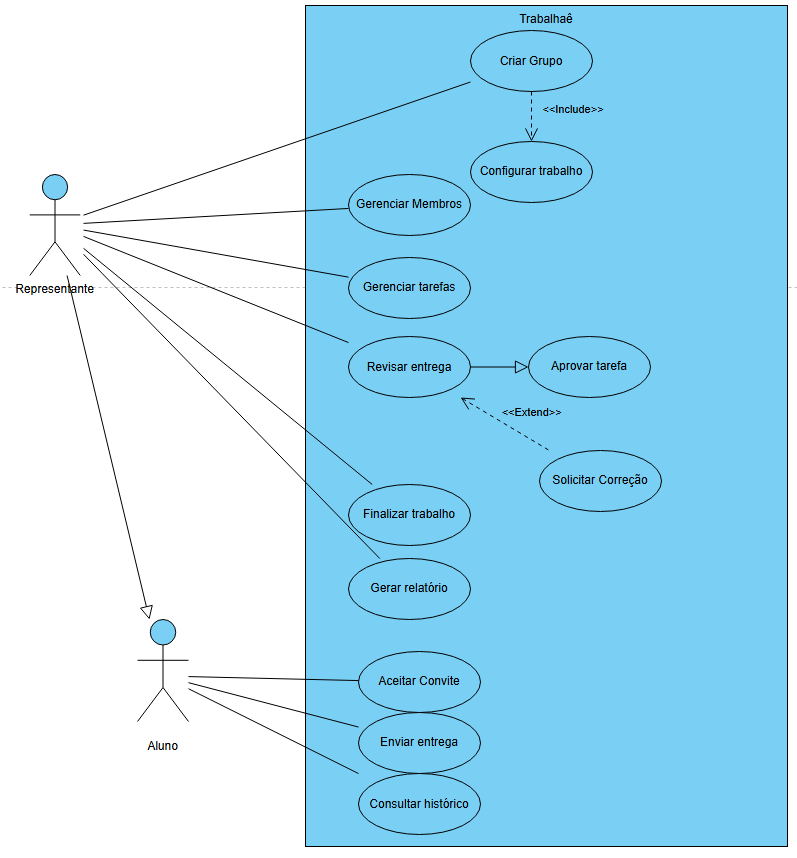
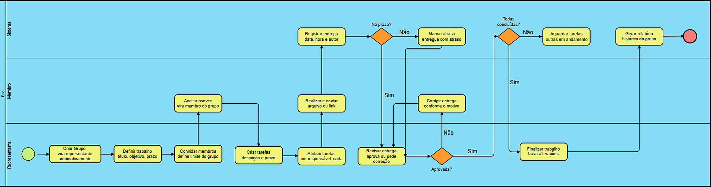
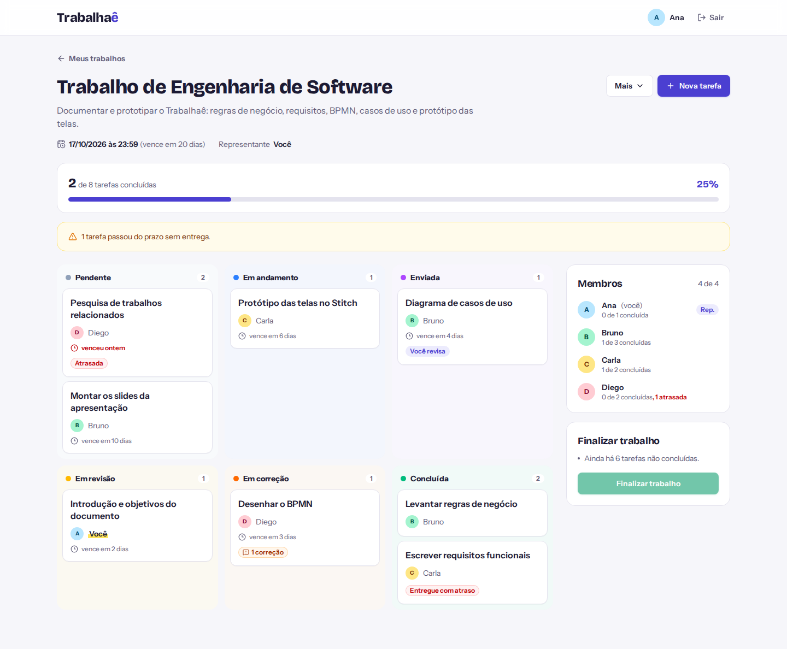

# Trabalhaê

**Aplicativo web para organização de trabalhos em grupo**

Trabalho acadêmico em grupo · FAETERJ-Rio · Curso Superior de Tecnologia em Análise e Desenvolvimento de Sistemas · 2026

> **Este é um trabalho em grupo cujo foco principal foi a documentação de software.**
> Antes de qualquer linha de código, o grupo analisou o problema, definiu as regras de negócio, levantou os requisitos funcionais e não funcionais e modelou o sistema com diagrama de casos de uso e BPMN. O código deste repositório é um protótipo funcional (MVP) construído **a partir dessa documentação**, para mostrar as regras e os requisitos funcionando na prática.

📄 **Documentação completa:** [`docs/documentacao/Trabalhae-documentacao.pdf`](docs/documentacao/Trabalhae-documentacao.pdf)

## Autores

- Bruno Oliveira de Almeida
- Ryan de Oliveira Costa

## O problema

Em trabalhos acadêmicos em grupo é comum aparecerem tarefas sem responsável definido, atrasos nas entregas, atividades concentradas em poucos integrantes e informações espalhadas por vários meios de comunicação. O Trabalhaê centraliza as tarefas, os responsáveis e os prazos em um só lugar e responde a uma pergunta específica: **quem ficou responsável por cada parte e quem realmente entregou**.

- Cada tarefa tem **um único responsável**.
- Toda entrega fica registrada com **data, hora e autor**, e não pode ser alterada.
- Atrasos ficam **marcados para sempre**.
- Cada parte passa por **revisão** antes de ser concluída.
- No fim, o sistema gera um **relatório** que o grupo anexa à entrega ao professor.

---

## A documentação

A documentação é a parte central do trabalho. Ela contém:

| Seção | Conteúdo |
|---|---|
| Introdução, objetivos e justificativa | O problema da organização de trabalhos em grupo e por que uma ferramenta dedicada ajuda |
| Metodologia | Desenvolvimento em 4 etapas sequenciais, cada uma servindo de base para a seguinte |
| Regras de negócio | 7 regras (RN01 a RN07) |
| Levantamento de requisitos | 16 requisitos funcionais (RF01 a RF16) e 8 não funcionais (RNF01 a RNF08) |
| Diagrama de casos de uso | Atores Representante e Aluno, com generalização (o Representante também é um Aluno) |
| BPMN | Processo completo, da criação do grupo ao relatório final, com raias para Representante, Membro e Sistema |

### Metodologia

1. **Definição do problema e do processo:** identificação do problema (falta de controle sobre quem é responsável por cada parte e quem realmente entregou) e desenho do fluxo, da criação do grupo até a finalização do trabalho.
2. **Definição das regras de negócio:** atribuição de um único responsável por tarefa, registro das entregas, controle de atrasos e revisão das partes enviadas.
3. **Levantamento de requisitos:** requisitos funcionais (o que o sistema deve fazer) e não funcionais (as características que o sistema deve ter).
4. **Modelagem do sistema:** BPMN, para o fluxo do processo, e diagrama de casos de uso, para as interações dos usuários com o sistema.

### Regras de negócio

| ID | Regra | Resumo |
|---|---|---|
| RN01 | Representante do grupo | Quem cria o grupo vira representante e define título, objetivo, prazo final e limite de membros. A função pode ser transferida. |
| RN02 | Formação do grupo | O aluno só vira membro depois de aceitar o convite, e o grupo não passa do limite de membros. |
| RN03 | Atribuição de tarefas | Só o representante cria e atribui tarefas. Cada tarefa tem um único responsável e prazo dentro do prazo final. |
| RN04 | Registro de entregas | Só o responsável entrega. Cada entrega guarda data, hora e autor e não pode ser alterada nem excluída; uma correção gera uma nova entrega. |
| RN05 | Controle de atraso | Tarefa não entregue no prazo fica "Atrasada"; entrega depois do prazo fica "Entregue com atraso". Tudo fica no histórico. |
| RN06 | Revisão de tarefas | O representante revisa as entregas, ninguém revisa a própria tarefa e a correção exige motivo. A tarefa só conclui com aprovação. |
| RN07 | Finalização do trabalho | Só finaliza com todas as tarefas concluídas. Depois disso nada pode ser alterado, e o sistema gera o relatório final. |

### Diagrama de casos de uso



### BPMN



---

## Da documentação ao código

O protótipo implementa o que foi documentado. As tabelas abaixo ligam cada item da documentação ao lugar onde ele está no sistema.

### Regras de negócio

No código e nos testes, as 7 regras da documentação aparecem desdobradas em **32 regras menores e verificáveis** (citadas como RN01 a RN32 nos comentários e nos nomes dos testes). A correspondência é esta:

| Documentação | Regras detalhadas no código | Onde |
|---|---|---|
| RN01 Representante do grupo | RN01 a RN06, RN10 | `services/grupoService.ts` |
| RN02 Formação do grupo | RN09, RN11 | `services/conviteService.ts` |
| RN03 Atribuição de tarefas | RN07, RN12 a RN17 | `services/tarefaService.ts` |
| RN04 Registro de entregas | RN18, RN19, RN26 | `services/entregaService.ts` e *triggers* do banco (`migrations/001_init.sql`) |
| RN05 Controle de atraso | RN20 a RN22 | `services/entregaService.ts` e `jobs/atrasos.ts` |
| RN06 Revisão de tarefas | RN23 a RN28 | `services/revisaoService.ts`, `services/acesso.ts` e `domain/maquinaEstados.ts` |
| RN07 Finalização do trabalho | RN15, RN29 a RN32 | `services/grupoService.ts` e `services/painelService.ts` |

Os caminhos são relativos a `backend/src/`. As escolhas feitas onde a documentação deixava espaço para interpretação estão em [DECISOES.md](DECISOES.md).

### Requisitos funcionais

| ID | Requisito | API | Tela |
|---|---|---|---|
| RF01 | Cadastro e autenticação | `POST /auth/cadastro`, `POST /auth/login` | Cadastro e Entrar |
| RF02 | Criar grupo | `POST /grupos` | Novo trabalho |
| RF03 | Definir dados do trabalho | `POST /grupos` e `PUT /grupos/{id}` | Novo trabalho e Editar trabalho |
| RF04 | Convidar membros | `POST /grupos/{id}/convites` | Painel do grupo |
| RF05 | Responder convite | `POST /convites/{id}/aceitar` e `/recusar` | Meus trabalhos |
| RF06 | Transferir representante | `POST /grupos/{id}/transferir-representante` | Painel do grupo |
| RF07 | Gerenciar tarefas | `POST /grupos/{id}/tarefas`, `PUT` e `DELETE /tarefas/{id}` | Painel do grupo e Tarefa |
| RF08 | Atribuir tarefas | `PUT /tarefas/{id}/responsavel` | Tarefa |
| RF09 | Enviar entrega | `POST /tarefas/{id}/entregas` | Tarefa |
| RF10 | Revisar entrega | `POST /tarefas/{id}/revisao/aprovar` e `/correcao` | Tarefa |
| RF11 | Reenviar após correção | `POST /tarefas/{id}/entregas` | Tarefa |
| RF12 | Controlar atrasos | calculado em toda resposta e registrado no histórico | Painel do grupo e Tarefa |
| RF13 | Painel do grupo | `GET /grupos/{id}/painel` | Painel do grupo |
| RF14 | Consultar histórico | `GET /grupos/{id}/historico` | Histórico |
| RF15 | Finalizar trabalho | `POST /grupos/{id}/finalizar` | Painel do grupo |
| RF16 | Gerar relatório final | `GET /grupos/{id}/relatorio` | Relatório |

A API completa está documentada no Swagger, em `/api/docs`.

### Requisitos não funcionais

| ID | Requisito | Como foi atendido |
|---|---|---|
| RNF01 | Fácil acesso | Aplicação web, publicada na Vercel, sem instalação |
| RNF02 | Compatibilidade | Layout responsivo para computador e celular ([exemplo no celular](docs/telas/09-painel-celular.png)) |
| RNF03 | Usabilidade | Status com selos coloridos e aviso de confirmação ou erro após cada ação |
| RNF04 | Segurança e controle de acesso | Senhas com BCrypt, login com JWT e permissões conferidas no backend de acordo com o papel no grupo |
| RNF05 | Integridade dos dados | Validação de todos os dados recebidos (Zod) e restrições no banco |
| RNF06 | Preservação do histórico | Data e hora vêm do servidor; o banco bloqueia alteração e exclusão das entregas e alteração do histórico |
| RNF07 | Desempenho | Site estático servido pela CDN da Vercel; cada tela carrega com poucas requisições (o painel inteiro vem em uma só) |
| RNF08 | Armazenamento de arquivos | PDF, DOCX, PNG e JPG, validados pela extensão e pelo tipo; até 10 MB (4 MB na versão publicada) |

---

## O sistema



Mais capturas em [`docs/telas`](docs/telas).

### Stack

| Parte | Tecnologias |
|---|---|
| Backend (`/backend`) | Node.js 22, TypeScript, Express, PostgreSQL, JWT, BCrypt, Zod, Swagger |
| Frontend (`/frontend`) | React 19, TypeScript, Vite, Tailwind CSS, React Router |
| Banco | PostgreSQL 16 (Docker no computador, Neon na versão publicada) |
| Testes | Vitest + Supertest contra um PostgreSQL real (114 testes) |
| Publicação | Vercel (site + API como função serverless) |

> O planejamento inicial previa Spring Boot. O backend foi feito em Node.js mantendo a mesma API, banco, arquitetura em camadas e regras. O motivo e o mapeamento de cada tecnologia estão em [DECISOES.md](DECISOES.md).

## Como rodar no computador

**Pré-requisitos:** [Node.js 22](https://nodejs.org) (ou 20.19+) e Docker Desktop, para subir o PostgreSQL com um comando. Se preferir um PostgreSQL instalado na máquina, veja a seção "Sem Docker".

Abra um terminal na pasta do projeto.

**1. Subir o banco**

```bash
docker compose up -d
```

**2. Rodar a API** (em um terminal)

```bash
cd backend
npm install
cp .env.example .env      # no Windows (cmd): copy .env.example .env
npm run seed              # cria as tabelas e os dados de exemplo
npm run dev
```

A API fica em <http://localhost:8080/api> e a documentação Swagger em <http://localhost:8080/api/docs>.

**3. Rodar o site** (em outro terminal)

```bash
cd frontend
npm install
npm run dev
```

Abra <http://localhost:5173>. Na tela de entrada aparecem atalhos para as contas de demonstração.

### Contas de demonstração

Todas com a senha **123456**:

| Conta | Situação |
|---|---|
| ana@trabalhae.com | Representante do grupo "Trabalho de Engenharia de Software" |
| bruno@trabalhae.com | Membro, revisor da tarefa da Ana |
| carla@trabalhae.com | Membro, representante do grupo "Projeto de Banco de Dados" |
| diego@trabalhae.com | Membro, com uma tarefa atrasada e outra em correção |
| eduardo@trabalhae.com | Sem grupo, com um convite pendente da Carla |

Para voltar os dados ao estado inicial a qualquer momento: `npm run seed` dentro de `backend`.

## Testes

Com o banco rodando:

```bash
cd backend
npm test
```

Os testes usam o banco separado `trabalhae_test`, criado automaticamente pelo Docker na primeira vez. Eles cobrem a máquina de estados da tarefa e todas as regras de negócio (arquivos em `backend/test/`).

## Roteiro de teste manual

Um caminho de uns 5 minutos que passa pelas regras da documentação:

1. **Entre como Eduardo.** Aparece o convite da Carla. Clique em **Aceitar**: você entra no grupo (RN02, RF05).
2. **Entre como Ana** e abra "Trabalho de Engenharia de Software".
   - O painel mostra as tarefas por status, o progresso e o aviso da tarefa atrasada do Diego (RF13, RN05).
   - Abra "Diagrama de casos de uso" (enviada pelo Bruno), clique em **Começar revisão** e depois **Pedir correção**. Tente sem motivo: o sistema recusa (RN06).
   - Clique em **Nova tarefa** e escolha você mesma como responsável: o sistema pede um revisor, porque ninguém revisa a própria tarefa (RN06).
3. **Entre como Bruno** e abra "Introdução e objetivos do documento" (tarefa da Ana). Como revisor indicado, clique em **Aprovar**: aparece o carimbo "Aprovada" (RF10).
4. **Entre como Diego** e abra "Desenhar o BPMN". O motivo da correção aparece em destaque. Clique em **Reenviar entrega corrigida** e anexe um PDF: a tarefa volta para revisão e a entrega anterior continua no histórico (RN04, RF11).
   - Abra "Pesquisa de trabalhos relacionados", que está atrasada, e envie: a entrega é aceita, mas fica marcada como **entregue com atraso** (RN05).
5. **Como Ana**, abra **Mais > Histórico do grupo**: está tudo registrado (RF14). Abra **Mais > Prévia do relatório** para ver o relatório por membro (RF16).
6. Quando todas as tarefas estiverem aprovadas, **Finalizar trabalho** fica disponível. Depois de finalizar, nada mais pode ser alterado (RN07, RF15).

## Publicar na Vercel

O projeto já vem pronto para a Vercel (`vercel.json` na raiz): o site vai como arquivos estáticos e a API roda como função serverless em `/api`, na região de São Paulo.

1. Em <https://vercel.com/new>, clique em **Import** no repositório do GitHub.
   - Deixe o **Root Directory** vazio (a raiz do repositório). Se a Vercel sugerir a pasta `backend` ou o preset **Services**, troque o preset para **Other** e deixe a raiz vazia.
   - Se ela importar variáveis do `.env.example`, apague todas. Elas servem só para rodar no computador.
   - Clique em **Deploy**.
2. No projeto criado, abra a aba **Storage**, escolha **Neon** (Postgres), crie o banco na região de São Paulo e conecte ao projeto **sem prefixo** nas variáveis. Isso cria a variável `DATABASE_URL`.
3. Na aba **Deployments**, abra o último deploy e clique em **Redeploy**, para a API enxergar o banco.
4. Abra o site. Na primeira requisição, a API cria as tabelas e, se o banco estiver vazio, os dados de exemplo (contas acima, senha `123456`). Para conferir, acesse `/api/saude`: se algo estiver errado, a resposta explica o motivo no campo `detalhe`.

Diferenças da versão publicada:

- Os arquivos das entregas ficam **no próprio banco** (a Vercel não guarda arquivos em disco) e o limite é de **4 MB** por arquivo (limite de corpo de requisição da Vercel).
- O registro de atrasos no histórico roda junto com as requisições, no máximo a cada 10 minutos, em vez de um timer de hora em hora.
- Opcional: crie a variável `JWT_SECRET` em **Settings > Environment Variables** com um texto longo qualquer. Sem ela, o segredo é derivado da URL do banco.

## Estrutura

```
trabalhae/
├── docs/
│   ├── documentacao/           documentação do trabalho (PDF) e diagramas
│   └── telas/                  capturas das telas
├── DECISOES.md                 escolhas de implementação
├── docker-compose.yml          PostgreSQL 16
├── vercel.json                 configuração da publicação na Vercel
├── api/index.js                entrada da API como função serverless
├── backend/
│   ├── migrations/             SQL versionado (estilo Flyway)
│   ├── scripts/                geração das migrações embutidas e banco de teste
│   ├── src/
│   │   ├── http/               rotas (controllers), validação, autenticação, erros
│   │   ├── services/           TODAS as regras de negócio
│   │   ├── repositories/       acesso ao banco (SQL)
│   │   ├── domain/             máquina de estados e datas
│   │   ├── jobs/               job de atrasos (de hora em hora)
│   │   ├── docs/               documentação OpenAPI
│   │   └── db/                 conexão, migração e seed
│   └── test/                   testes automatizados
└── frontend/
    └── src/
        ├── api/                cliente HTTP e chamadas da API (separado das telas)
        ├── paginas/            telas
        ├── modais/             janelas de ação
        ├── componentes/        botões, selos, carimbo, layout
        └── contexto/           login e avisos
```

A chamada à API fica separada da parte visual (`src/api`), então as telas podem ser redesenhadas a partir de layouts do Google Stitch sem mexer na lógica.

## Sem Docker

Com um PostgreSQL 16 instalado, crie o usuário e os bancos:

```sql
CREATE USER trabalhae WITH PASSWORD 'trabalhae' CREATEDB;
CREATE DATABASE trabalhae OWNER trabalhae;
CREATE DATABASE trabalhae_test OWNER trabalhae;
```

Depois siga a partir do passo 2 de "Como rodar no computador". Se usar outro usuário, senha ou porta, ajuste `DATABASE_URL` e `TEST_DATABASE_URL` no `backend/.env`.

## Scripts

| Onde | Comando | O que faz |
|---|---|---|
| backend | `npm run dev` | API com recarga automática |
| backend | `npm run seed` | recria os dados de exemplo (só no perfil `dev`) |
| backend | `npm run migrate` | aplica as migrações pendentes |
| backend | `npm test` | roda os testes |
| backend | `npm run build` e `npm start` | versão compilada |
| backend | `npm run migracoes:embutir` | atualiza a cópia das migrações usada na Vercel (rode depois de criar um `.sql`) |
| frontend | `npm run dev` | site em modo de desenvolvimento |
| frontend | `npm run build` | gera a versão final em `frontend/dist` |
| raiz | `npm run build:vercel` | build usado pela Vercel (backend + site) |
